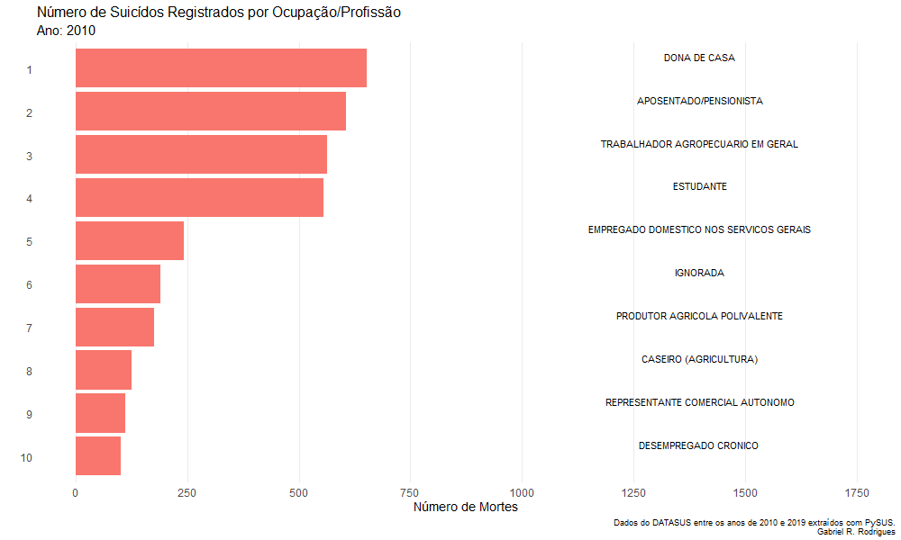

```{r setup and pre_processing, warning = FALSE, message = FALSE, echo = FALSE}
# Initializing ====
# Loading libraries
load_libraries <- function(){
  if (!require("dplyr"))
    install.packages("dplyr")
  if (!require("forcats"))
    install.packages("forcats")
  if(!require("geobr"))
    install.packages("geobr")
  if (!require("gganimate"))
    install.packages("gganimate")
  if (!require("ggplot2"))
    install.packages("ggplot2")
  if(!require("gifski"))
    install.packages("gifski")
  if(!require("lubridate"))
    install.packages("lubridate")
  if(!require("magrittr"))
    install.packages("magrittr")
  if(!require("maps"))
    install.packages("maps")
  if(!require("plotly"))
    install.packages("plotly")
  if(!require("psych"))
    install.packages("psych")
  if(!require("scales"))
    install.packages("scales")
  if(!require("sf"))
    install.packages("sf")
  if(!require("stringr"))
    install.packages("stringr")
  if(!require("tidyr"))
    install.packages("tidyr")
}

load_libraries()

# Getting data
df <- read.csv('D:\\Data Science\\Projetos\\suicide_in_brazil\\data\\df.csv',
               encoding = 'UTF-8')[-1]

# Creating design objects ====
create_design <- function(){
  # Fill color
  fill_color <- '#f68060'
  
  # Caption
  caption <- 'Dados do DATASUS entre os anos de 2010 e 2019 extraídos com PySUS.
  Gabriel R. Rodrigues'
  
  # Setting main theme
  project_theme <- 
    theme_minimal() + 
    theme(legend.position = "none",
          panel.grid.minor.x = element_blank(),
          panel.grid.minor.y = element_blank(),
          panel.grid.major.y = element_blank(),
          axis.ticks.x = element_blank(),
          panel.border = element_blank(),
          plot.title = element_text(size = 16),
          plot.subtitle = element_text(size = 15),
          axis.text = element_text(size = 12),
          axis.title = element_text(size = 14))
  
  # Setting map theme
  project_map_theme <-
    theme_minimal() + 
    theme(panel.grid.minor.x = element_blank(),
          panel.grid.minor.y = element_blank(),
          panel.grid.major.y = element_blank(),
          axis.ticks.x = element_blank(),
          panel.border = element_blank(),
          plot.title = element_text(size = 16),
          plot.subtitle = element_text(size = 15),
          axis.text = element_blank(),
          axis.title = element_blank())
  
  list_of_objects <- list(
    'fill_color' = fill_color,
    'caption' = caption,
    'project_theme' = project_theme,
    'project_map_theme' = project_map_theme
  )
  
  return(list_of_objects)
}

design <- create_design()

# Initial cleaning ====
clean_data <- function(df){
  # Making missings known
  df[df == 'NaN'] <- NA
  
  # State as factor
  df$estado %<>% as.factor
  
  # Arranging dates
  format <- "%d%m%Y"
  df$DTOBITO <- parse_date_time(df$DTOBITO, format)
  df$DTNASC <- parse_date_time(df$DTNASC, format)
  
  # Creating 'month' column
  df$mes <- month(df$DTOBITO)
  
  # Sex as factor
  df$SEXO %<>% as.factor
  
  # Race/color as factor
  df$RACACOR[df$RACACOR == ''] <- NA
  df$RACACOR %<>% as.factor
  
  
  # Medical assistance as factor
  df$ASSISTMED[df$ASSISTMED == ''] <- NA
  df$ASSISTMED %<>% as.factor
  
  # Mother's education as factor
  df$ESCMAE %<>% as.factor
  df$ESCMAE <- factor(df$ESCMAE,
                      levels = c('Nenhuma',
                                 '1 a 3 anos',
                                 '4 a 7 anos',
                                 '8 a 11 anos',
                                 '12 e mais'))
  
  # Marital status as factor
  df$ESTCIV %<>% as.factor
  df$ESTCIV <- factor(df$ESTCIV,
                      levels = c('Solteiro',
                                 'União consensual',
                                 'Casado',
                                 'Separado judicialmente',
                                 'Viúvo'))
  
  levels(df$ESTCIV)[1] <- 'Solteiro/a'
  levels(df$ESTCIV)[3] <- 'Casado/a'
  levels(df$ESTCIV)[4] <- 'Separado/a judicialmente'
  levels(df$ESTCIV)[5] <- 'Viúvo/a'
  
  # Education as factor
  df$ESC %<>% as.factor
  df$ESC <- factor(df$ESC,
                   levels = c('Nenhuma',
                              '1 a 3 anos',
                              '4 a 7 anos',
                              '8 a 11 anos',
                              '12 e mais'))
  
  # Ocupation as factor
  df$OCUP %<>% as.factor
  
  df$OCUP[str_detect(df$OCUP, "\\d")] <- NA
  #' This last function corrects a problem found in the data.
  #' A lot of occupations were not coded correctly by the CBO.
  #' The reason why this happened is unclear.
  #' This resulted in various data points containing 'random' numbers,
  #' such as '1021', '11112' and '14221'. This should be an ocupation,
  #' however, I can't seem to find the code for it, and the CBO isn't
  #' covering this properly. If you know something about this, feel free
  #' to contact me.
  #' 
  #' What the code does is the following:
  #' Detect in `df$OCUP` any string that contains numbers (`\\d` in regex).
  #' When you find this, replace with `NA` (`<- NA`)
  
  # Place of occurence as factor
  df$LOCOCOR[df$LOCOCOR == '6'] <- NA #' There isn't code for '6': replace with NA
  df$LOCOCOR %<>% as.factor
  
  # Received surgery (yes/no) as factor
  df$CIRURGIA[df$CIRURGIA == ''] <- NA
  df$CIRURGIA %<>% as.factor
  
  return(df)
}

df <- clean_data(df)

# Creating dataframes with number of deaths by month/year ====
year_total <- df %>% group_by(ano) %>% count()

month_total <- df %>% group_by(mes) %>% count()

ym_total <- df %>% 
  group_by(ano, mes) %>% 
  count() %>% 
  tidyr::unite(mes, ano, col = 'index', sep = '-')

# Creating variations in percentage from one time period to another ====
#' *year_variation*
year_variation <- as.data.frame(year_total)
rownames(year_variation) <- year_variation$ano
year_variation %<>% select(-ano)

year_variation <- as.ts(year_variation, start = c(2010), frequency = 1)

year_variation <- year_variation/stats::lag(year_variation, -1) - 1

year_variation <- as.data.frame(year_variation)
#' *month variation*
month_variation <- as.data.frame(month_total)
rownames(month_variation) <- month_variation$mes
month_variation %<>% select(-mes)

month_variation <- as.ts(month_variation, start = c(1), frequency = 1)

month_variation <- month_variation/stats::lag(month_variation, -1) - 1

month_variation <- as.data.frame(month_variation)

#' *ym_variation*
ym_variation <- as.data.frame(ym_total)
rownames(ym_variation) <- ym_variation$index
ym_variation %<>% select(-index)
rownames(ym_variation) <- NULL

ym_variation <- as.ts(ym_variation, start = c(2010, 1), frequency = 12)

ym_variation <- ym_variation/stats::lag(ym_variation, -1) - 1

ym_variation <- as.data.frame(ym_variation)
```

## Sobre
Esse trabalho é um projeto pessoal realizado a fim de exercitar habilidades em
visualização de dados e jornalismo de dados usando R. Todas as figuras formadas
utilizaram o pacote *ggplot2* e *plotly*. Os gifs foram feitos através do pacote
*gganimate*. Além de utilizar o *ggplot2*, os mapas foram criados a partir dos 
pacotes *geobr*, *maps* e *sf* (um agradecimento especial ao código fornecido
por Gerson Júnior e Henrique Martins na iniciativa 
<a href= "https://opencodecom.net/post/2021-04-20-criando-mapas-no-r-mundo-e-brasil/" target="_blank">Open Code Community</a>).

O objetivo principal para realização do trabalho não interferiu na qualidade de
tratamento dos dados. Os dados foram extraídos utilizando-se a ferramenta 
<a href="https://github.com/AlertaDengue/PySUS" target= "_blank">PySUS</a>,
seguindo-se o tutorial descrito <a href= "https://medium.com/psicodata/baixando-e-processando-dados-do-datasus-sobre-suic%C3%ADdio-com-python-656afa17f6ad?source=friends_link&sk=4e94866d21707aefec13aafe5923d6f1" target="_blank">aqui</a>, como 
reiterados nesse vídeo
<a href="https://www.youtube.com/watch?v=7TxlU5mgABk" target="_blank">aqui</a>.
Essa mesma metodologia foi a empregada por
<a href="https://www.scielo.br/pdf/rbp/v31s2/v31s2a07.pdf" target="_blank">Lovisi et al. (2009)</a>.

Foram baixados os dados de 2010 a 2019, contemplando 10 anos de uma série 
histórica.
Os dados foram pré-processados em Python, podendo todos os procedimentos 
iniciais de pré-processamento serem verificados <a href="https://github.com/GabrielReisR/suicide_in_brazil/blob/main/getting_pysus_data_2010_2019.ipynb" target= "_blank">neste link</a>.
A manipulação de dados para realização das análises e criação das visualizações 
foram realizadas em R, conforme descrito
<a href="https://github.com/GabrielReisR/suicide_in_brazil/blob/main/analyses/analyses.R" target="_blank">nesse documento aqui</a>.

O repositório no GitHub para esse trabalho está
<a href="https://github.com/GabrielReisR/suicide_in_brazil/" target="_blank">aqui</a>.
Todas as análises aqui descritas devem ser passíveis de replicação direta ao se
executar o código presente no repositório.

Qualquer dúvida, comentário ou retificação podem ser enviadas para 
reisrgabriel@gmail.com ou em algum link
<a href="https://linktr.ee/gabrielrr" target="_blank">aqui</a>.

## Série temporal
### Suicídio ao longo dos anos
Inicia-se com uma observação geral sobre o fenômeno do suicídio nesses últimos 10
anos. De forma geral, a quantidade de suicídios aumentou todos os anos, indo de
9476 no ano de 2010 a 13554 no ano de 2019. Em média, foram registrados 11249
suicídios por ano nesses últimos 10 anos.

```{r suicides_across_years, echo = FALSE, message=FALSE, warning=FALSE}
format <- '%m-%Y'
ym_total$index <- parse_date_time(ym_total$index, format)

suicides_across_years_img <- 
  ym_total %>% 
  
  # Plot
  ggplot(aes(x = as.Date(index), y = n)) +
  
  # Geom
  geom_line(size = 1, colour = design$fill_color) +
  
  # X-axis: Limits and ticks
  scale_x_date(date_breaks = 'years', date_labels = '%Y') +
  
  # Y-axis: Limits and ticks
  scale_y_continuous(breaks = seq(0, 1500, by = 250),
                     limits = c(0, 1500)) +
  
  # Labels
  labs(x= "",
       y = "",
       title = "Número de Suicídios Registrados no Brasil em 10 Anos",
       caption = design$caption) +
  
  # Removing legend title
  design$project_theme

ggplotly(suicides_across_years_img)
```

Uma possibilidade é que o aumento de casos de suicídio esteja seguindo o aumento
populacional ao longo dos anos. Essa variável não foi controlada e caracteriza
uma das principais limitações desse projeto, já que um aumento de suicídio em 
números brutos não significa aumento percentual de suicídios em relação à 
população brasileira.

Tendo isso em mente, prosseguimos com uma análise dos anos, buscando entender
momentos de maior e menor aumento nos casos de suicídio.

```{r suicide_var_by_year, echo = FALSE, out.width = "100%", fig.align = 'center'}

```

Na figura, pode-se observar uma linha vertical que ultrapassa o ponto 4.08% -
essa foi a média anual de aumento em números brutos de suicídio. Os anos de 2013,
2014, 2016 e 2018 apresentaram aumento em números brutos de suicídio menor do
que a média nos últimos 10 anos. Nessa mesma figura, o ano de 2017 chama a
atenção como o ano com maior aumento percentual no número bruto de casos de
suicídio. Casos de suicídio registrados pelo DATASUS passaram de 11455 (em 2016)
para 12521 em 2017 - um aumento de 9.31% no número bruto de casos registrados.

### Suicídio ao longo dos meses
Será que existem meses que tendem a registrar maior número de casos de suicídio
que outros? De modo geral, o mês de Dezembro contou com o maior número de 
registros de suicídio pelo DATASUS; Junho contou com o menor número de registros
de suicídio pelo DATASUS.

```{r monthly_suicide, echo=FALSE,fig.align= 'center', message=FALSE, warning=FALSE, out.width="100%"}
# Criando a coluna nome_mes
month_total$nome_mes <- c('Janeiro', 'Fevereiro', 'Março', 
                          'Abril', 'Maio', 'Junho',
                          'Julho', 'Agosto', 'Setembro',
                          'Outubro', 'Novembro', 'Dezembro')
month_total$nome_mes %<>% as.factor

monthly_suicide <-
  month_total %>%
  
  mutate(nome_mes = fct_relevel(nome_mes,
                                'Dezembro', 'Novembro', 'Outubro',
                                'Setembro', 'Agosto', 'Julho', 
                                'Junho', 'Maio', 'Abril',
                                'Março', 'Fevereiro', 'Janeiro')) %>% 
  # Plot
  ggplot(aes(x = nome_mes, y = n)) +
  
  # Geom
  geom_bar(stat = "identity", fill = design$fill_color, width = .8) +
  
  # Labels
  labs(x = '',
       y = '',
       title = 'Número Total de Suicídios Registrados por Mês',
       caption = design$caption) +
  
  # Flipping coordinates
  coord_flip() +
  
  # Theme
  design$project_theme

ggplotly(monthly_suicide)
```

Considerando o número total acima, podemos criar uma visualização demonstrando
as alterações percentuais de suicídio em relação ao mês anterior. Realizando
uma pequena transformação nos dados, percebemos que os meses de Fevereiro e
Junho apresentaram quedas nos registros de suicídio no DATASUS. Ao mesmo tempo,
os meses de Março e Dezembro apresentaram altas nos registros de suicídio se
comparados aos seus meses antecedentes.

```{r suicide_var_by_month, out.width="100%", echo = FALSE, message=FALSE, warning=FALSE}
month_variation$index <- c('Fevereiro', 'Março', 'Abril',
                           'Maio', 'Junho', 'Julho',
                           'Agosto', 'Setembro', 'Outubro',
                           'Novembro', 'Dezembro')
month_variation$index <- factor(month_variation$index,
                                levels = c('Fevereiro', 'Março', 'Abril',
                                           'Maio', 'Junho', 'Julho',
                                           'Agosto', 'Setembro', 'Outubro',
                                           'Novembro', 'Dezembro'))

# Hyperparameters
global_mean <- mean(month_variation$month_variation)
x_start <- as.Date("2013-03-01")
y_start <- 0.0465
x_end <- as.Date("2014-03-01")
y_end <- global_mean

suicide_var_by_month <-
  month_variation %>% 
  
  mutate(index = fct_relevel(index,
                             'Dezembro', 'Novembro',
                             'Outubro', 'Setembro', 'Agosto',
                             'Julho', 'Junho', 'Maio',
                             'Abril', 'Março', 'Fevereiro')) %>% 
  
  # Plot
  ggplot(aes(x = index, y = month_variation, # to make 'percent' work
             color = 'black', fill = month_variation)) +
  
  # Geom
  geom_col() +
  
  # Y-axis: Limits and ticks
  scale_y_continuous(breaks = seq(-0.1, 0.1, 0.025), limits = c(-0.1, 0.1),
                     labels = percent) +
  
  # X-axis: Colors
  scale_fill_gradient2(low = 'white', high = design$fill_color) +
  
  # Labels
  labs(x = '',
       y = 'Variação em Relação ao Mês Anterior',
       title = 'Variação Total no Número de Casos Registrados por Mês',
       caption = design$caption) +
  
  # Adding line
  geom_hline(yintercept = global_mean, color = "#181818", linetype = 3) +
  
  # Theme
  design$project_theme +
  
  coord_flip()

ggplotly(suicide_var_by_month, tooltip = 'month_variation')
```

Será que essa variação de mês a mês permaneceu a mesma ao longo dos anos?
Olhando com calma, ano a ano, percebe-se que a variação percentual em relação ao 
mês anterior é bastante oscilante.

```{r suicide_var_by_year_by_month, echo = FALSE, out.width = "100%", fig.align = 'center'}
knitr::include_graphics("../figures/suicide_var_by_year_by_month.gif")
```
Agosto de 2014, Março de 2018 e Março de 2019 apresentaram as maiores variações
percentuais quando comparadas a seus meses anteriores. Fazendo uma rápida e 
superficial busca percebeu-se que acontecimentos políticos relevantes rondaram
esse período:

* Agosto de 2014: período eleitoral no qual o político Eduardo Campos, então 
concorrente à presidência, sofreu um grave acidente aéreo que o levou a óbito.
* Março de 2018: assassinato a tiros da vereadora Marielle Franco, crime ainda
não solucionado.
* Março de 2019: tiroteio em uma escola de Suzano provocado por dois ex-alunos.
10 pessoas morreram e diversas foram feridas.

Para o número de casos por mês e variação por mês, consulte essa tabela
abaixo:

```{r casos_por_mes_e_variacao,echo=FALSE,warning=FALSE,message=FALSE,rows.print = 12}
# Criando variação com meses
ym_variation[120, ] <- NA # criando última linha
ym_variation$index <- rep(c('Fevereiro', 'Março', 'Abril',
                            'Maio', 'Junho', 'Julho',
                            'Agosto', 'Setembro', 'Outubro',
                            'Novembro', 'Dezembro', 'Janeiro'), 10)

ym_variation <- ym_variation[1:119, ] # excluindo última linha

# Criando coluna do ano
ym_variation$ano <- year(ym_total$index)[2:120]
ym_variation$ano %<>% as.factor

# Criando nova coluna
ym_variation %<>% 
  unite(index, ano,
        col = 'data',
        sep = " de ") %>% 
  rename('variacao' = ym_variation) %>% 
  mutate(variacao = paste0(round(100*variacao, 2), '%')) %>% 
  select(data, variacao)

# Criando linha de janeiro de 2010
janeiro_2010 <- data.frame(data = 'Janeiro de 2010',
                           variacao = NA)

final_df <- rbind(janeiro_2010,
                  ym_variation)

# Juntando número com variação
ym_total$data <- final_df$data

final_df %<>% 
  left_join(ym_total, by = 'data') %>% 
  select(-index) %>% 
  rename('numero' = n) %>% 
  select(numero, variacao, data)

rownames(final_df) <- final_df$data
final_df %<>% select(-data)

final_df
```

## Quem morre por suicídio?
### Gênero
Em geral, os homens morrem mais de suicídios que as mulheres no Brasil. 
O número absoluto de suicídios registrados foi de 88394 para homens 
(78,58%) e 24075 para mulheres (21,40%).

```{r sexo_por_ano, echo=FALSE}
df %>% 
  filter(SEXO != 'NA') %>% 
  group_by(ano, SEXO) %>% 
  count()
```

Observando-se o gif abaixo, percebe-se que a relação entre suicídios de homens 
e mulheres se mostrou razoavelmente constante ao longo dos anos.
```{r, echo = FALSE, out.width = "75%", fig.align = 'center'}

```

**Importante**: Na base de dados DATASUS, não foi encontrada uma variável que 
pudesse especificar se a pessoa que morreu de suicídio se identificava como cis
ou como trans. Nesse sentido, há falta de informação qualificada sobre o 
suicídio de pessoas trans em uma das principais bases de dados pública em saúde
do país. Em meio a essa dificuldade, a Associação Nacional de Travestis e 
Transsexuais 
(<a href="https://antrabrasil.org/" target="_blank">ANTRA</a>) publicou que 
houve um aumento e 34% no número de suicídios de pessoas trans no Brasil
em 2020, quando comparado a 2019 
(<a href= "https://www.uol.com.br/vivabem/noticias/redacao/2020/09/09/aumento-do-numero-de-suicidios-entre-populacao-trans-preocupa-ativistas.htm" target="_blank">link da reportagem</a>). Tais dados, 
entretanto, foram baseados nos *casos alcançados* pela ANTRA. A falta de uma
variável que codifique isso de forma acessível no DATASUS dificulta o mapeamento
do suicídio de pessoas trans - que pode ser considerado um problema de
saúde pública. Outra importante variável que não é considerada pelo banco de
dados do DATASUS é a orientação sexual, importante atravessamento relacionado
à saúde mental.

### Raça/cor
Em relação à raça/cor, de acordo com a classificação do IBGE:

* A maioria dos casos de suicídio atinge a população branca (51,29%).
* Somando-se os percentuais da população preta (5,42%) e parda (41,80%),
tem-se que 47,22% dos casos atinge a população negra do Brasil.

```{r suicides_by_race, echo= FALSE}
suicides_by_race <- 
  
  df %>% 
  # Cleaning
  
  filter(RACACOR != 'NA') %>%
  
  group_by(RACACOR) %>% 
  
  summarize(n = n()) %>%
  
  arrange(desc(n), .by_group = T) %>%
  
  # Plot
  ggplot(aes(x = reorder(RACACOR, n), y = n, fill = design$fill_color)) +
  
  # Geom
  geom_col() +
  
  # Y-axis: Limits and ticks
  scale_y_continuous(breaks = seq(0, 60000, 10000),
                     limits = c(0, 60000)) +
  
  # Labels
  labs(x = '',
       y = '',
       title = 'Número de Suicídios Registrados por Raça/Cor',
       caption = design$caption) +
  
  # Flipping coordinates
  coord_flip() +
  
  # Theme
  design$project_theme

ggplotly(suicides_by_race, tooltip = 'n')
```

### Nível de escolaridade
Realizando o recorte por anos de educação formal, o grupo que teve entre 4 a 7
anos de educação foi o que mais morreu de suicídio, totalizando 32,35% dos 
casos. Esse grupo equivale às pessoas com ensino fundamental I completo ou 
ensino fundamental II incompleto.
Em segundo lugar, as pessoas com ensino médio completo ou incompleto (8 a 11 
anos de educação), totalizando 30,77% dos casos.

Apenas 11,76% dos casos foram registrados com pessoas que tinham ensino superior
completo ou incompleto. Ainda, pessoas sem nenhum nível educacional registraram
o menor índice de suicídios, com 6,16%. É importante refletir que o baixo
percentual de suicídios para pessoas sem nenhum nível educacional talvez seja 
reflexo do baixo número populacional de brasileiros/as sem nenhum nível formal
de educação.

```{r suicides_by_education, fig.align= 'center',echo=FALSE, message=FALSE, warning=FALSE}
suicides_by_education <- 
  
  df %>% 
  # Cleaning
  
  filter(ESC != 'NA') %>%
  
  group_by(ESC) %>% 
  
  summarize(n = n()) %>%
  
  # Plot
  ggplot(aes(x = ESC, y = n, fill = design$fill_color)) +
  
  # Geom
  geom_col() +
  
  # Y-axis: Limits and ticks
  scale_y_continuous(breaks = seq(0, 30000, 10000),
                     limits = c(0, 30000)) +
  
  # Labels
  labs(x = 'Escolaridade',
       y = '',
       title = 'Número de Suicídios Registrados por Escolaridade',
       caption = design$caption) +
  
  # Flipping coordinates
  coord_flip() +
  
  # Theme
  design$project_theme


ggplotly(suicides_by_education, tooltip = 'n')
```

### Estado civil
Em relação ao estado civil:

* A maioria dos registros de suicídio no Brasil entre 2010 e 2019 foram de
pessoas solteiras (54,46%).
* Pessoas casadas ocupam a segunda posição, com 28,90% dos casos de suicídio
ao longo dos últimos 10 anos.

```{r suicides_by_marital_status, echo = F}
suicides_by_marital_status <- 
  
  df %>% 
  # Cleaning
  
  filter(ESTCIV != 'NA') %>%
  
  group_by(ESTCIV) %>% 
  
  summarize(n = n()) %>%
  
  arrange(desc(n), .by_group = T) %>%
  
  # Plot
  ggplot(aes(x = fct_reorder(ESTCIV, n), y = n, fill = design$fill_color)) +
  
  # Geom
  geom_col() +
  
  # Y-axis: Limits and ticks
  scale_y_continuous(breaks = seq(0, 60000, 10000),
                     limits = c(0, 60000)) +
  
  # Labels
  labs(x = '',
       y = '',
       title = 'Número de Suicídios por Estado Civil',
       caption = design$caption) +
  
  # Flipping coordinates
  coord_flip() +
  
  # Theme
  design$project_theme

ggplotly(suicides_by_marital_status, tooltip = 'n')

```


### Trabalho e suicídio
Considerando-se os últimos 10 anos, as 20 ocupações com maior registro de
suicídio foram as seguintes:

```{r suicides_top_20_ocupations, echo=FALSE, message=FALSE, warning=FALSE}
suicides_by_ocup_img <-
  
  df %>%
  
  # Cleaning
  filter(OCUP != 'NA') %>% 
  
  group_by(OCUP) %>% 
  
  summarize(n = n()) %>%
  
  arrange(desc(n), .by_group = T) %>% 
  
  top_n(n = 20) %>%
  
  # Plot
  
  ggplot(aes(x = fct_reorder(as.factor(OCUP), n), y = n,
             group = OCUP, fill = design$fill_color)) +
  
  # Geom
  geom_col() +
  
  # Y-axis
  scale_y_continuous(breaks = seq(0, 8000, 2000),
                     limits = c(0, 8000)) +
  
  # Labels
  labs(x = '',
       y = '',
       title = '',
       caption = design$caption) +
  
  
  # Flipping coordinates
  coord_flip() +
  
  # Theme
  design$project_theme

ggplotly(suicides_by_ocup_img, tooltip = 'n')
```

Desde 2010 até 2019, apenas 10 profissões/ocupações estão presentes no topo dos
casos de suicídio.

```{r suicides_by_ocupation_through_years, echo= F, message=F, warning=F}

```

Por ano, percebe-se uma evolução no número de casos registrados de suicídios por
estudantes.

```{r student_suicides, echo= FALSE}
student_suicides <-
  df %>%
  
  # Cleaning
  filter(OCUP != 'NA') %>% 
  
  mutate(ano = as.factor(ano)) %>% 
  
  group_by(ano) %>% 
  
  count() %>%
  
  # Plot
  ggplot(aes(x = ano, y = n, fill = design$fill_color)) +
  
  # Geom
  geom_col() +
  
  # Labels
  labs(x = '',
       y = '',
       title = 'Número de Suicídios Registrados de Estudantes',
       caption = design$caption) +
  
  # Flipping coordinates
  coord_flip() +
  
  # Theme
  design$project_theme

ggplotly(student_suicides, tooltip = c('ano', 'n'))

```
Para quem se interessar, aí vão os números brutos de suicídios registrados para
cada uma dessas 10 profissões ao longo dos anos:

```{r tabela de ocupacoes por ano, echo=F, message=F, warning=F, rows.print=10}
df$OCUP %<>% as.factor

df$OCUP[str_detect(df$OCUP, "\\d")] <- NA

df %>%
  
  # Cleaning
  filter(OCUP != 'NA') %>% 
  
  group_by(ano, OCUP) %>% 
  
  summarize(n = n()) %>%
  
  arrange(desc(n), .by_group = T) %>%
  
  top_n(n = 10) %>% 
  
  mutate(ordem = 1:n())
```

## Onde o suicídio acontece?
### Local de ocorrência
Em relação à classificação do local de ocorrência, percebe-se que 

* A maioria dos suicídios ocorre nas próprias casas (60,89% dos casos).
* 15,69% dos casos de suicídio ocorreram em Hospitais. Isso parece ser um fator
de confusão: é possível que as mortes advindas de suicídio tenham ocorrido no
hospital - por isso esse alto percentual de casos nesse local.
* Ademais, 6,24% dos suicídios ocorreram em via pública.

```{r suicides_by_place_of_occurence, echo=F, warning=F, message=F}
suicides_by_place_of_occurence <- 
  
  df %>% 
  # Cleaning
  
  filter(LOCOCOR != 'NA') %>%
  
  group_by(LOCOCOR) %>% 
  
  summarize(n = n()) %>%
  
  arrange(desc(n), .by_group = T) %>%
  
  # Plot
  ggplot(aes(x = reorder(LOCOCOR, n), y = n, fill = design$fill_color)) +
  
  # Geom
  geom_col() +
  
  # Y-axis: Limits and ticks
  scale_y_continuous(breaks = seq(0, 70000, 20000),
                     limits = c(0, 70000)) +
  
  # Labels
  labs(x = '',
       y = '',
       title = 'Local de Ocorrência de Suicídios',
       caption = design$caption) +
  
  # Flipping coordinates
  coord_flip() +
  
  # Theme
  design$project_theme

ggplotly(suicides_by_place_of_occurence, tooltip = 'n')
```


### Suicídios por estados
A maioria dos suicídios, em números brutos, ocorreram nas regiões Sul e Sudeste.
Um problema de olhar para números brutos é ignorar números relativos a população
do estado. Essa limitação não foi sanada nessa análise, que considerou apenas
números brutos.

*Para entender os números relativos a cada estado, navegue com o mouse por cima*
*do mapa abaixo.*

```{r suicide_by_states, echo=FALSE, message=FALSE, warning=FALSE}
load('../data/estados.RData')
suicide_by_states <- estados %>%
  
  ggplot() +
  
  geom_sf(aes(fill = taxa_suicidio, group = abbrev_state), size = .15) +
  
  scale_fill_gradient2(low = "white", high = design$fill_color,
                       name = "Proporção de suicídios\npor nº de habitantes",
                       limits = c(0, 0.111))  +
  
  labs(x = '',
       y = '',
       title = "Taxa de Suicídios de Acordo com a População de Cada Estado Brasileiro",
       subtitle = "Número populacional retirado do último censo do IBGE.",
       caption  = design$caption) +
  
  theme(plot.caption = element_text(hjust = 0, face= "italic"),
        plot.title.position = "plot", 
        plot.caption.position =  "plot") +
  
  geom_sf_label(aes(label = abbrev_state),
                size = 3) +
  
  design$project_map_theme


ggplotly(suicide_by_states)
```
Abaixo, confira o número bruto de suicídios registrados por estado.

* Roraima registrou o menor número de suicídios (n = 402),
seguido por Amapá (n = 429) e Acre (n = 508).

* São Paulo é o estado com maior número de registros de suicídio (n = 21970),
seguido por Minas Gerais (n = 13541) e Rio Grande do Sul (n = 11860).

Vamos lembrar que a média de suicídio por ano, nesses últimos 10 anos, foi de 
11249 casos ao ano. Nesse sentido, 

* Minas Gerais colaborou para o registro de 1 ano de casos de suicídio no 
Brasil - o mesmo poderia ser dito do Rio Grande do Sul.
* Seguindo o mesmo raciocínio, São Paulo colaborou para aproximadamente 2 anos
de casos de suicídio no Brasil. No geral, esses três estados registraram 42% de
todos os casos de suicídio no Brasil nesses últimos 10 anos.

Proporcionalmente ao número de habitantes (retirado de
<a href="https://cidades.ibge.gov.br/brasil/df/panorama" target="_blank">IBGE</a>):

* A menor taxa de suicídios foi no Rio de Janeiro, contabilizando 0.034% de
pessoas que morreram por suicídio considerando o último censo do IBGE.

* Seguindo o Rio de Janeiro está o estado de Pará (0.035%), Bahia (0.037%),
e Alagoas (0.037%).

* Os estados com maior proporção de suicídios por número de habitantes foram
Rio Grande do Sul (0.111%), Santa Catarina (0.102%) e Mato Grosso do 
Sul (0.093%).

* Apesar de São Paulo possuir um maior número bruto de suicídios, quando
controlado pelo número populacional do estado a taxa de suicídio de SP (0.059%) 
se aproxima da média dos outros estados (0.063%).

```{r n_suicides_by_states, echo=F, message=F, warning=F, rows.print=27}
as.data.frame(estados) %>% 
  select(-c(code_state, code_region, name_region, geom)) %>% 
  arrange(abbrev_state) %>% 
  select(-abbrev_state) %>% 
  rename('estado' = name_state)
```

Caso queira saber quais os números brutos de suicídio por estado ao ano, aí vai
uma nova tabela:

```{r n_suicides_by_states_by_year, echo=F, message=F, warning=F, rows.print=27}
df %>%
  group_by(ano, estado) %>%
  dplyr::summarise(n = n())
```

## Assistência médica e suicídio
O DATASUS possui uma variável chamada de "ASSISTMED". Essa variável codifica se
o caso registrado no sistema recebeu assistência médica. Apesar de um alto
número de casos sem registro nessa variável (casos missing = 41804), percebe-se
que a maioria dos casos registrados de suicídio não receberam assistência médica
(79,67%).

```{r suicides_medical_assistance, echo=F, message=F, warning=F}
suicides_medical_assistance <- 
  
  df %>% 
  # Cleaning
  
  filter(ASSISTMED != 'NA') %>%
  
  group_by(ASSISTMED) %>% 
  
  summarize(n = n()) %>%
  
  arrange(desc(n), .by_group = T) %>%
  
  # Plot
  ggplot(aes(x = reorder(ASSISTMED, n), y = n,
             fill = design$fill_color)) +
  
  # Geom
  geom_col() +
  
  # Y-axis: Limits and ticks
  scale_y_continuous(breaks = seq(0, 60000, 10000),
                     limits = c(0, 60000)) +
  
  # Labels
  labs(x = 'Recebeu assistência médica?',
       y = '',
       title = '',
       caption = design$caption) +
  
  # Theme
  design$project_theme +
  
  theme(panel.grid.major.x = element_blank())

ggplotly(suicides_medical_assistance, tooltip = 'n')
```

Além disso, apenas 152 casos foram registrados como tendo recebido cirurgia.

```{r suicides_surgery, echo=F, message=F, warning=F}
suicides_surgery <- 
  
  df %>% 
  # Cleaning
  
  filter(CIRURGIA != 'NA') %>%
  
  group_by(CIRURGIA) %>% 
  
  summarize(n = n()) %>%
  
  arrange(desc(n), .by_group = T) %>%
  
  # Plot
  ggplot(aes(x = reorder(CIRURGIA, n), y = n,
             fill = design$fill_color)) +
  
  # Geom
  geom_col() +
  
  # Y-axis: Limits and ticks
  scale_y_continuous(breaks = seq(0, 10000, 2500),
                     limits = c(0, 10000)) +
  
  # Labels
  labs(x = 'Recebeu cirurgia?',
       y = '',
       title = '',
       caption = design$caption) +
  
  # Theme
  design$project_theme +
  
  theme(panel.grid.major.x = element_blank())

ggplotly(suicides_surgery, tooltip = 'n')
```


## Resumo geral
Esse trabalho buscou delinear características demográficas da população que 
morreu de suicídio entre os anos de 2010 e 2019 no Brasil.

De forma geral, observou-se que:

* A média de suicídios ao longo de 2010 e 2019, por ano, é de 11249. De modo
geral, o número bruto de suicídios vem aumentando ao longo dos anos.
* Os meses de Dezembro, Outubro e Março, respectivamente, contaram com o maior
número de casos de suicídio.
* Ano após ano, homens (78,58%) morreram mais de suicídio do que as mulheres.
  * Não se tem dados estruturados sobre a população transgênero pelo DATASUS.
* A população que mais morre de suicídio é majoritariamente autodeclarada 
branca (51,29%). Além disso, somando-se os percentuais da população
autodeclarada preta (5,42%) e autodeclarada parda (41,80%), tem-se que 47,22% 
dos casos atinge a população negra do Brasil.
* Pessoas com ensino fundamental I completo ou ensino fundamental II incompleto
somaram 32,35% dos casos de suicídio. Após isso, 30,77% dos casos de suicídio
foram registrados em pessoas com ensino médio completo ou incompleto.
* A maioria dos registros de suicídio no Brasil entre 2010 e 2019 foram de
pessoas solteiras (54,46%).
* Aposentados/as e pensionistas, estudantes, donas de casa, trabalhadores/as
agropecuários em geral, e empregados/as doméstico nos serviços gerais foram as
profissões que mais registraram suicídios no Brasil entre 2010 e 2019.
  * Estudantes têm liderado o número de suicídios no Brasil desde 2017, seguidos
  por aposentados/as e trabalhadores/as agropecuários em geral. 
* O local mais comum para ocorrência do suicídio é no domicílio (60,89% dos
casos).
* Roraima registrou o menor número de suicídios ao longo dos últimos
10 anos (n = 402), seguido por Amapá (n = 429) e Acre (n = 508).
* São Paulo é o estado com maior número de registros de suicídio (n = 21970),
seguido por Minas Gerais (n = 13541) e Rio Grande do Sul (n = 11860).
* Os estados com maior proporção de suicídios por número de habitantes foram
Rio Grande do Sul (0.111%), Santa Catarina (0.102%) e Mato Grosso do 
Sul (0.093%).
* A maioria dos casos de suicídio não receberam nem assistência médica nem
cirurgia.

## Contato
Esse trabalho buscou dar um panorama geral sobre os casos de suicídio no Brasil
entre 2010 e 2019. Além disso, o
<a href= "https://github.com/GabrielReisR/suicide_in_brazil" target="_blank">código aberto do trabalho</a>
permite que qualquer pessoa com habilidades no R possa tentar replicar as análises
aqui descritas. De toda a forma, ressalta-se que a utilização de figuras ou 
análises aqui descritas devem ser acompanhadas da referência a esse trabalho.

Caso tenha errado em algum ponto ou me equivocado na breve explicação de algo,
adoraria receber sugestões de melhoria desse documento. Você pode falar comigo
através dos links presentes em 
<a href= "https://linktr.ee/gabrielrr" target= "_blank"></a>

Gostou muito do trabalho e quer apoiar o tempo dedicado a ele?
Se quiser, 
<a href="https://ko-fi.com/gabrielrr" target="_blank">você pode me pagar um café</a>.
