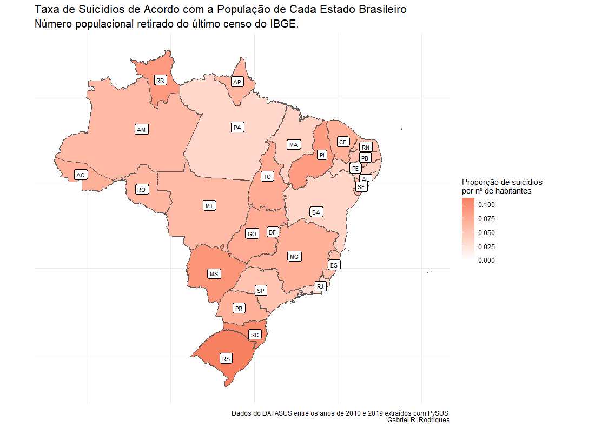

```{r setup and pre_processing, warning = FALSE, message = FALSE, echo = FALSE}
# Initializing ====
# Loading libraries
load_libraries <- function(){
  if (!require("dplyr"))
    install.packages("dplyr")
  if (!require("forcats"))
    install.packages("forcats")
  if(!require("geobr"))
    install.packages("geobr")
  if (!require("gganimate"))
    install.packages("gganimate")
  if (!require("ggplot2"))
    install.packages("ggplot2")
  if(!require("gifski"))
    install.packages("gifski")
  if(!require("lubridate"))
    install.packages("lubridate")
  if(!require("magrittr"))
    install.packages("magrittr")
  if(!require("maps"))
    install.packages("maps")
  if(!require("plotly"))
    install.packages("plotly")
  if(!require("psych"))
    install.packages("psych")
  if(!require("scales"))
    install.packages("scales")
  if(!require("sf"))
    install.packages("sf")
  if(!require("stringr"))
    install.packages("stringr")
  if(!require("tidyr"))
    install.packages("tidyr")
}

load_libraries()

# Getting data
df <- read.csv('D:\\Data Science\\Projetos\\suicide_in_brazil\\data\\df.csv',
               encoding = 'UTF-8')[-1]

# Creating design objects ====
create_design <- function(){
  # Fill color
  fill_color <- '#f68060'
  
  # Caption
  caption <- 'Dados do DATASUS entre os anos de 2010 e 2019 extraídos com PySUS.'
  
  # Setting main theme
  project_theme <- 
    theme_minimal() + 
    theme(legend.position = "none",
          panel.grid.minor.x = element_blank(),
          panel.grid.minor.y = element_blank(),
          panel.grid.major.y = element_blank(),
          axis.ticks.x = element_blank(),
          panel.border = element_blank(),
          plot.title = element_text(size = 16),
          plot.subtitle = element_text(size = 15),
          axis.text = element_text(size = 12),
          axis.title = element_text(size = 14))
  
  # Setting map theme
  project_map_theme <-
    theme_minimal() + 
    theme(panel.grid.minor.x = element_blank(),
          panel.grid.minor.y = element_blank(),
          panel.grid.major.y = element_blank(),
          axis.ticks.x = element_blank(),
          panel.border = element_blank(),
          plot.title = element_text(size = 16),
          plot.subtitle = element_text(size = 15),
          axis.text = element_blank(),
          axis.title = element_blank())
  
  list_of_objects <- list(
    'fill_color' = fill_color,
    'caption' = caption,
    'project_theme' = project_theme,
    'project_map_theme' = project_map_theme
  )
  
  return(list_of_objects)
}

design <- create_design()

# Initial cleaning ====
clean_data <- function(df){
  # Making missings known
  df[df == 'NaN'] <- NA
  
  # State as factor
  df$estado %<>% as.factor
  
  # Arranging dates
  format <- "%d%m%Y"
  df$DTOBITO <- parse_date_time(df$DTOBITO, format)
  df$DTNASC <- parse_date_time(df$DTNASC, format)
  
  # Creating 'month' column
  df$mes <- month(df$DTOBITO)
  
  # Sex as factor
  df$SEXO %<>% as.factor
  
  # Race/color as factor
  df$RACACOR[df$RACACOR == ''] <- NA
  df$RACACOR %<>% as.factor
  
  
  # Medical assistance as factor
  df$ASSISTMED[df$ASSISTMED == ''] <- NA
  df$ASSISTMED %<>% as.factor
  
  # Mother's education as factor
  df$ESCMAE %<>% as.factor
  df$ESCMAE <- factor(df$ESC,
                      levels = c('1 a 3 anos',
                                 '4 a 7 anos',
                                 '8 a 11 anos',
                                 '12 e mais'))
  
  # Marital status as factor
  df$ESTCIV %<>% as.factor
  df$ESTCIV <- factor(df$ESTCIV,
                      levels = c('Solteiro',
                                 'União consensual',
                                 'Casado',
                                 'Separado judicialmente',
                                 'Viúvo'))
  
  levels(df$ESTCIV)[1] <- 'Solteiro/a'
  levels(df$ESTCIV)[3] <- 'Casado/a'
  levels(df$ESTCIV)[4] <- 'Separado/a judicialmente'
  levels(df$ESTCIV)[5] <- 'Viúvo/a'
  
  # Education as factor
  df$ESC %<>% as.factor
  df$ESC <- factor(df$ESC,
                   levels = c('Nenhuma',
                              '1 a 3 anos',
                              '4 a 7 anos',
                              '8 a 11 anos',
                              '12 e mais'))
  
  # Ocupation as factor
  df$OCUP %<>% as.factor
  
  df$OCUP[str_detect(df$OCUP, "\\d")] <- NA
  #' This last function corrects a problem found in the data.
  #' A lot of occupations were not coded correctly by the CBO.
  #' The reason why this happened is unclear.
  #' This resulted in various data points containing 'random' numbers,
  #' such as '1021', '11112' and '14221'. This should be an ocupation,
  #' however, I can't seem to find the code for it, and the CBO isn't
  #' covering this properly. If you know something about this, feel free
  #' to contact me.
  #' 
  #' What the code does is the following:
  #' Detect in `df$OCUP` any string that contains numbers (`\\d` in regex).
  #' When you find this, replace with `NA` (`<- NA`)
  
  # Place of occurence as factor
  df$LOCOCOR[df$LOCOCOR == '6'] <- NA #' There isn't code for '6': replace with NA
  df$LOCOCOR %<>% as.factor
  
  # Received surgery (yes/no) as factor
  df$CIRURGIA[df$CIRURGIA == ''] <- NA
  df$CIRURGIA %<>% as.factor
  
  return(df)
}

df <- clean_data(df)

# Creating dataframes with number of deaths by month/year ====
year_total <- df %>% group_by(ano) %>% count()

month_total <- df %>% group_by(mes) %>% count()

ym_total <- df %>% 
  group_by(ano, mes) %>% 
  count() %>% 
  tidyr::unite(mes, ano, col = 'index', sep = '-')

# Creating variations in percentage from one time period to another ====
#' *year_variation*
year_variation <- as.data.frame(year_total)
rownames(year_variation) <- year_variation$ano
year_variation %<>% select(-ano)

year_variation <- as.ts(year_variation, start = c(2010), frequency = 1)

year_variation <- year_variation/stats::lag(year_variation, -1) - 1

year_variation <- as.data.frame(year_variation)
#' *month variation*
month_variation <- as.data.frame(month_total)
rownames(month_variation) <- month_variation$mes
month_variation %<>% select(-mes)

month_variation <- as.ts(month_variation, start = c(1), frequency = 1)

month_variation <- month_variation/stats::lag(month_variation, -1) - 1

month_variation <- as.data.frame(month_variation)

#' *ym_variation*
ym_variation <- as.data.frame(ym_total)
rownames(ym_variation) <- ym_variation$index
ym_variation %<>% select(-index)
rownames(ym_variation) <- NULL

ym_variation <- as.ts(ym_variation, start = c(2010, 1), frequency = 12)

ym_variation <- ym_variation/stats::lag(ym_variation, -1) - 1

ym_variation <- as.data.frame(ym_variation)
```

## Sobre
Esse trabalho é um projeto pessoal realizado a fim de exercitar habilidades em
visualização de dados e jornalismo de dados usando R. Todas as figuras formadas
utilizaram o pacote *ggplot2*. Os gifs foram feitos através do pacote
*gganimate*. Além de utilizar o *ggplot2*, os mapas foram criados a partir dos 
pacotes *geobr*, *maps* e *sf* (um agradecimento especial ao código fornecido
por Gerson Júnior e Henrique Martins na iniciativa 
[*Open Code Community*](https://opencodecom.net/post/2021-04-20-criando-mapas-no-r-mundo-e-brasil/)).

O objetivo principal para realização do trabalho não interferiu na qualidade de
tratamento dos dados. Os dados foram extraídos utilizando-se a ferramenta [PySUS](https://github.com/AlertaDengue/PySUS),
seguindo-se o tutorial descrito [aqui](https://medium.com/psicodata/baixando-e-processando-dados-do-datasus-sobre-suic%C3%ADdio-com-python-656afa17f6ad?source=friends_link&sk=4e94866d21707aefec13aafe5923d6f1), como 
reiterados nesse vídeo [aqui](https://www.youtube.com/watch?v=7TxlU5mgABk). Essa
mesma metodologia foi a empregada por 
[Lovisi et al. (2009)](https://www.scielo.br/pdf/rbp/v31s2/v31s2a07.pdf).

Foram baixados os dados de 2010 a 2019, contemplando 10 anos de uma série 
histórica.
Os dados foram pré-processados em Python, podendo todos os procedimentos 
iniciais de pré-processamento serem verificados [neste link](https://github.com/GabrielReisR/suicide_in_brazil/blob/main/getting_pysus_data_2010_2019.ipynb).
A manipulação de dados para realização das análises e criação das visualizções 
foram realizadas em R, conforme descrito
[nesse documento aqui](https://github.com/GabrielReisR/suicide_in_brazil/blob/main/analyses/analyses.R).

O repositório no GitHub para esse trabalho está
[aqui](https://github.com/GabrielReisR/suicide_in_brazil/). Todas as análises
aqui descritas devem ser passíveis de replicação direta ao se executar o código
presente no repositório.

Qualquer dúvida, comentário ou retificação podem ser enviadas para 
reisrgabriel@gmail.com

## Série temporal
#### Suicídio ao longo dos anos
Inicia-se com uma observação geral sobre o fenômeno do suicídio nesses últimos 10
anos. De forma geral, a quantidade de suicídios aumentou todos os anos, indo de
9476 no ano de 2010 a 13554 no ano de 2019.

```{r suicides_across_years, echo = FALSE, message=FALSE, warning=FALSE}
format <- '%m-%Y'
ym_total$index <- parse_date_time(ym_total$index, format)

suicides_across_years_img <- 
  ym_total %>% 
  
  # Plot
  ggplot(aes(x = as.Date(index), y = n)) +
  
  # Geom
  geom_line(size = 1, colour = design$fill_color) +
  
  # X-axis: Limits and ticks
  scale_x_date(date_breaks = 'years', date_labels = '%Y') +
  
  # Y-axis: Limits and ticks
  scale_y_continuous(breaks = seq(0, 1500, by = 250),
                     limits = c(0, 1500)) +
  
  # Labels
  labs(x= "",
       y = "",
       title = "Número de Suicídios Registrados no Brasil em 10 Anos",
       caption = design$caption) +
  
  # Removing legend title
  design$project_theme

ggplotly(suicides_across_years_img)
```

Uma possibilidade é que o aumento de casos de suicídio esteja seguindo o aumento
populacional ao longo dos anos. Essa variável não foi controlada e caracteriza
uma das principais limitações desse projeto, já que um aumento de suicídio em 
números brutos não significa aumento percentual de suicídios em relação à 
população brasileira.

Tendo isso em mente, prosseguimos com uma análise dos anos, buscando entender
momentos de maior e menor aumento nos casos de suicídio.

```{r suicide_var_by_year, echo = FALSE, out.width = "100%", fig.align = 'center'}
knitr::include_graphics("../figures/suicide_var_by_year.png")
```

Na figura, pode-se observar uma linha vertical que ultrapassa o ponto 4.08% -
essa foi a média anual de aumento em números brutos de suicídio. Os anos de 2013,
2014, 2016 e 2018 apresentaram aumento em números brutos de suicídio menor do
que a média nos últimos 10 anos. Nessa mesma figura, o ano de 2017 chama a
atenção como o ano com maior aumento percentual no número bruto de casos de
suicídio. Casos de suicídio registrados pelo DATASUS passaram de 11455 (em 2016)
para 12521 em 2017 - um aumento de 9.31% no número bruto de casos registrados.

#### Suicídio ao longo dos meses
Será que existem meses que tendem a registrar maior número de casos de suicídio
que outros? De modo geral, o mês de Dezembro contou com o maior número de 
registros de suicídio pelo DATASUS; Junho contou com o menor número de registros
de suicídio pelo DATASUS.

```{r monthly_suicide, echo=FALSE,fig.align= 'center', message=FALSE, warning=FALSE, out.width="100%"}
# Criando a coluna nome_mes
month_total$nome_mes <- c('Janeiro', 'Fevereiro', 'Março', 
                          'Abril', 'Maio', 'Junho',
                          'Julho', 'Agosto', 'Setembro',
                          'Outubro', 'Novembro', 'Dezembro')
month_total$nome_mes %<>% as.factor

monthly_suicide <-
  month_total %>%
  
  mutate(nome_mes = fct_relevel(nome_mes,
                                'Dezembro', 'Novembro', 'Outubro',
                                'Setembro', 'Agosto', 'Julho', 
                                'Junho', 'Maio', 'Abril',
                                'Março', 'Fevereiro', 'Janeiro')) %>% 
  # Plot
  ggplot(aes(x = nome_mes, y = n)) +
  
  # Geom
  geom_bar(stat = "identity", fill = design$fill_color, width = .8) +
  
  # Labels
  labs(x = '',
       y = '',
       title = 'Número Total de Suicídios Registrados por Mês',
       caption = design$caption) +
  
  # Flipping coordinates
  coord_flip() +
  
  # Theme
  design$project_theme

ggplotly(monthly_suicide)
```

Considerando o número total acima, podemos criar uma visualização demonstrando
as alterações percentuais de suicídio em relação ao mês anterior. Realizando
uma pequena transformação nos dados, percebemos que os meses de Fevereiro e
Junho apresentaram quedas nos registros de suicídio no DATASUS. Ao mesmo tempo,
os meses de Março e Dezembro apresentaram altas nos registros de suicídio se
comparados aos seus meses antecedentes.

```{r suicide_var_by_month, out.width="100%", echo = FALSE, message=FALSE, warning=FALSE}
month_variation$index <- c('Fevereiro', 'Março', 'Abril',
                           'Maio', 'Junho', 'Julho',
                           'Agosto', 'Setembro', 'Outubro',
                           'Novembro', 'Dezembro')
month_variation$index <- factor(month_variation$index,
                                levels = c('Fevereiro', 'Março', 'Abril',
                                           'Maio', 'Junho', 'Julho',
                                           'Agosto', 'Setembro', 'Outubro',
                                           'Novembro', 'Dezembro'))

# Hyperparameters
global_mean <- mean(month_variation$month_variation)
x_start <- as.Date("2013-03-01")
y_start <- 0.0465
x_end <- as.Date("2014-03-01")
y_end <- global_mean

suicide_var_by_month <-
  month_variation %>% 
  
  mutate(index = fct_relevel(index,
                             'Dezembro', 'Novembro',
                             'Outubro', 'Setembro', 'Agosto',
                             'Julho', 'Junho', 'Maio',
                             'Abril', 'Março', 'Fevereiro')) %>% 
  
  # Plot
  ggplot(aes(x = index, y = month_variation, # to make 'percent' work
             color = 'black', fill = month_variation)) +
  
  # Geom
  geom_col() +
  
  # Y-axis: Limits and ticks
  scale_y_continuous(breaks = seq(-0.1, 0.1, 0.025), limits = c(-0.1, 0.1),
                     labels = percent) +
  
  # X-axis: Colors
  scale_fill_gradient2(low = 'white', high = design$fill_color) +
  
  # Labels
  labs(x = '',
       y = 'Variação em Relação ao Mês Anterior',
       title = 'Variação Percentual Total no Número de Casos Registrados de Suicídio no Brasil por Mês',
       caption = design$caption) +
  
  # Adding line
  geom_hline(yintercept = global_mean, color = "#181818", linetype = 3) +
  
  # Theme
  design$project_theme +
  
  coord_flip()

ggplotly(suicide_var_by_month)
```

Será que essa variação de mês a mês permaneceu a mesma ao longo dos anos?
Olhando com calma, ano a ano, percebe-se que a variação percentual em relação ao 
mês anterior é bastante oscilante.

```{r suicide_var_by_year_by_month, echo = FALSE, out.width = "100%", fig.align = 'center'}

```
Agosto de 2014, Março de 2018 e Março de 2019 apresentaram as maiores variações
percentuais quando comparadas a seus meses anteriores. Fazendo uma rápida busca,
acontecimentos políticos relevantes rondaram esse período:

* Agosto de 2014: período eleitoral no qual o político Eduardo Campos, então 
concorrente à presidência, sofreu um grave acidente aéreo que o levou a óbito.
* Março de 2018: assassinato a tiros da vereadora Marielle Franco, crime ainda
não solucionado.
* Março de 2019: tiroteio em uma escola de Suzano provocado por dois ex-alunos.
10 pessoas morreram e diversas foram feridas.

Para o número de casos por mês e variação por mês, consulte essa tabela
abaixo:

```{r casos_por_mes_e_variacao,echo=FALSE,warning=FALSE,message=FALSE}
# Criando variação com meses
ym_variation[120, ] <- NA # criando última linha
ym_variation$index <- rep(c('Fevereiro', 'Março', 'Abril',
                            'Maio', 'Junho', 'Julho',
                            'Agosto', 'Setembro', 'Outubro',
                            'Novembro', 'Dezembro', 'Janeiro'), 10)

ym_variation <- ym_variation[1:119, ] # excluindo última linha

# Criando coluna do ano
ym_variation$ano <- year(ym_total$index)[2:120]
ym_variation$ano %<>% as.factor

# Criando nova coluna
ym_variation %<>% 
  unite(index, ano,
        col = 'data',
        sep = " de ") %>% 
  rename('variacao' = ym_variation) %>% 
  mutate(variacao = paste0(round(100*variacao, 2), '%')) %>% 
  select(data, variacao)

# Criando linha de janeiro de 2010
janeiro_2010 <- data.frame(data = 'Janeiro de 2010',
                           variacao = NA)

final_df <- rbind(janeiro_2010,
                  ym_variation)

# Juntando número com variação
ym_total$data <- final_df$data

final_df %<>% 
  left_join(ym_total, by = 'data') %>% 
  select(-index) %>% 
  rename('numero' = n) %>% 
  select(numero, variacao, data)

rownames(final_df) <- final_df$data
final_df %<>% select(-data)

final_df
```


#### Visualização da série histórica

 

#### Suicídios por sexo

Em geral, os homens cometem mais suicídios que as mulheres no Brasil. O número absoluto de suicídios registrados em homens foi de 88394 para homens (78,58%) e 24075	para mulheres (21,40%).

```{r tabela de sexo por ano, echo = F}
df %>% 
  group_by(ano, SEXO) %>% 
  count()
```

```{r, echo = FALSE, out.width = "75%", fig.align = 'center'}
knitr::include_graphics("../figures/suicides_by_sex_by_year.gif")
```

## Ocupações

Desde 2010 até 2019, apenas 10 profissões/ocupações estão presentes no topo dos casos de suicídio. Em números absolutos, a ordem de suicídios por profissão é a seguinte:

```{r tabela de ocupacoes por ano, echo = F}
df$OCUP %<>% as.factor

df$OCUP[str_detect(df$OCUP, "\\d")] <- NA

df %>%
  
  # Cleaning
  filter(OCUP != 'NA') %>% 
  
  group_by(OCUP) %>% 
  
  summarize(n = n()) %>%
  
  arrange(desc(n), .by_group = T) %>% 
  
  mutate(ordem = 1:n())
```

Por ano, percebe-se uma evolução no número de casos registrados de suicídios por estudantes. Separando-se apenas as 10 profissões mais relevantes a cada ano, a ordem é a seguinte:

## Estados
```{r, echo = FALSE, out.width = "100%", fig.align = 'center'}

```

